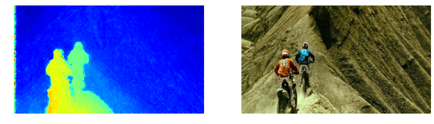
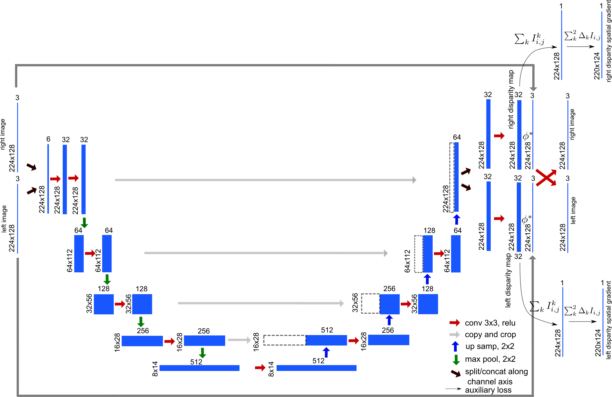

# W-net: Self-Supervised Learning of Depthmap from Stereo Images. 

W-net is a self-supervised convolutional neural network architecture to learn to predict depth maps from pairs of 
stereo images. The network is trained directly on pairs of stereo images to jointly reconstruct the left view from
the right view and the rihgt view from the left view, using learned disparity maps and the L1 norm as a reconstruction
error metric.  A probabilistic selection layer that applies simple geometric transformations is used to reconstruct 
the left/right view from the right/left view and the corresponding disparity map. This probabilistic selection layer was 
first introduced by Deep3d, an architecture to predic depth maps from monocular images and convert 2d movies to 3d
(see https://arxiv.org/abs/1604.03650). 
To handle the texture-less region where the reconstruction problem is ill-defined, we use an auxiliary output loss to minimize the spatial gradient of 
the learned disparity maps. This auxiliary output loss however is weighted by the original image's gradient so that it
is only enforced in regions of image where there is no texture, and still allows the disparity map to have sharp transition
at the edges of foreground object. 

The gif shown on the right is an example of inference of depthmap from stereo images from the movie point break 2, one of the movies held out for validation.

The processes of calculating the disparity map, reconstructing the two views and computing
the spatial gradients are all encompassed into a single, end to end framework that can be trained without 
ground truth, but rather by checking that the learned function is self-consistent.

A test on te KITTI dataset is coming soon. There is still a lot of room for improvement, but the model is capable of infering depthmap at a rate of **20fps** from images of resolution 192x336 on a GTX 1070. More importantly, gathering more data for training is an easy process in this case since the model does not require depthmap ground truth. Eventually, this type of neural net for infering depth from stereo images could become a much cheaper and much higher resolution and range alternative to lidar systems.

### Architecture

The architecture of w-net is heavily inspired by the u-net architecture, a residual learning architecture with with multiscale contracting paths used to perform nerve segmentation in the 
2016 Ultrasound Nerve Segmentation Kaggle competition. Its particularity is to bring back activation from the lower layers 
to the higher level, so that, in the case of the nerve segmentation task, the network has a highly detailed reference against
which to draw the masks deliminating the nerve cross sections.

In the case of w-net, the disaprity needs to be calculated at 
the same spatial resolution as the original image, which is intuitively why bringing back up the lower level activations would  help. 

The second particularity of w-net is the fact that its input consists in a pair of stereo images, which are
concatenated along the channel axis, as shown in the schematic above. We use depth wise separable convolutions in order not
 to loose the cross channel features (https://arxiv.org/abs/1610.02357). This is espacially needed here as the two images are 
 concatenated along the channel axis and need to stay separable.
 
The third particulrity of w-net is the presence of both a probabilistic selection layer, which uses the calculated disparity
to apply geometrical transformations from the left to right images, as well as a gradient layer which computes the spatial
gradient of the calculated disparity map in order to enforce some level of smoothness with the help of an auxiliary loss function.

The selection layer is as described in [deep3d](https://arxiv.org/abs/1604.03650). 
The network predicts a probability distribution across possible disparity values d at each pixel location. To get the right image from the left image and the disparity map, and check that the disparity map is correct, we first define a shifted stack of the left view, then we use the disparity map to calculate the right image as the sum of the disparity level and the shifted image pixel value.

This operation differentiable with respect to the disparity. This means that we will be able to train the network using backpropagation to modify the disparity map infered from both the left and right image until it is correct, e.g. we can properly reconstruct the right image from the left image and the disparity map using the equation above.

This selection layer will not contain any learnable weight, its output is completely deterministic given an image and a disparity map. Its only role is to contain information about the simple geometric rules that allow one to calculate right image from left and disparity. This infusion of expert knowledge is all the network needs to start being able to compute depth from pairs of images. 

In summary, the selection layer needs to do the following:

* construct the shifted left image stack 
* compute the right image by performing a dot product along the disparity values axis

See the included notebook for a detailed explanation and implementation.

### Training

The model is implemented in **Keras**/**Tensoflow**, and is trained on data from 22 3d movies, sampled at 1 fps. Validation is 
perfomred on 3 held out movies. The total number of stereo frame is about 125K, training took 4 days on a gtx 1070 with 
batches of 6 stereo images with resolution 192x336 per eye. Batch normalization is used.
